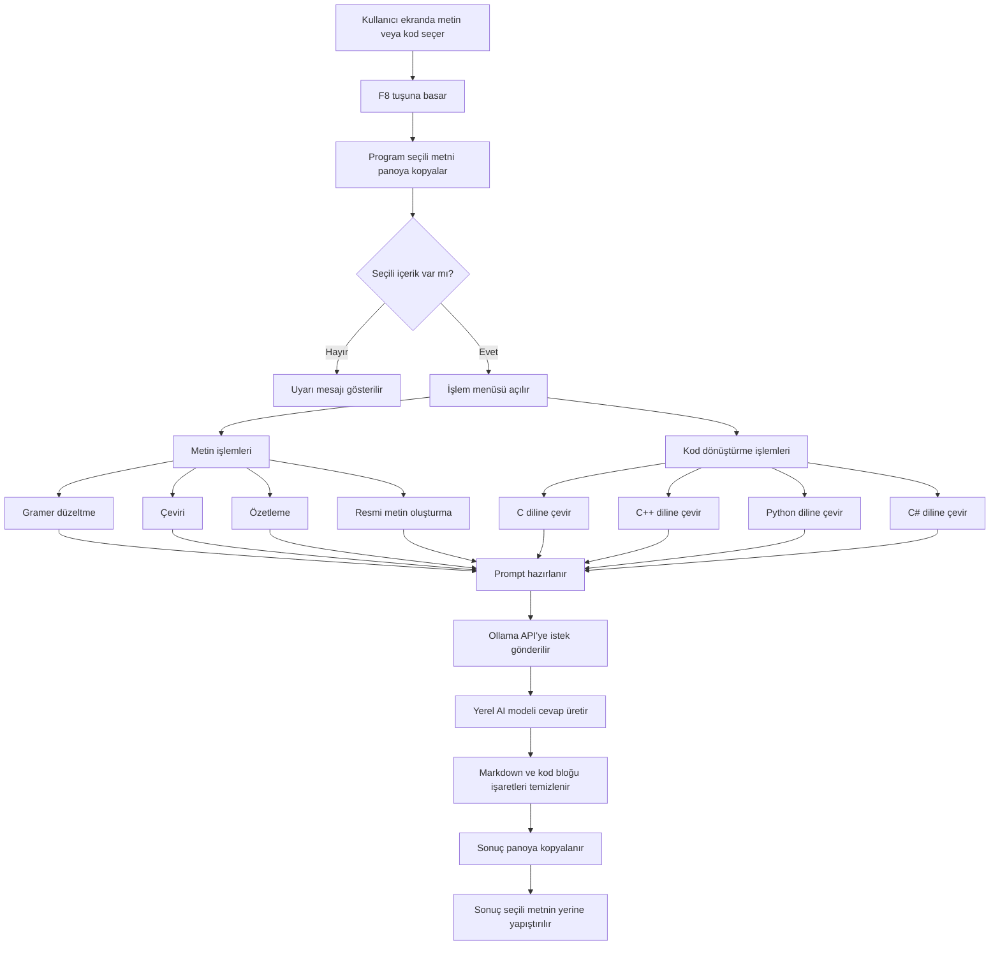

# Introduction to Data Visualization Project Assignment

Bu proje, seçili metin veya kod üzerinde yapay zeka destekli işlemler yapabilen bir masaüstü yardımcı uygulamasıdır.  
Uygulama, kullanıcının ekranda seçtiği metni `F8` kısayolu ile algılar ve Ollama üzerinden çalışan yerel yapay zeka modeliyle çeşitli işlemler gerçekleştirir.

Projeye ek olarak **AI destekli kod dönüştürme özelliği** geliştirilmiştir. Bu özellik sayesinde kullanıcı, herhangi bir yerde bulunan C, C++, Python veya C# kodunu seçerek farklı programlama dillerine çevirebilir.

---

## Projenin Amacı

Bu projenin temel amacı, kullanıcının seçtiği metin veya kod üzerinde hızlı yapay zeka işlemleri gerçekleştirmesini sağlamaktır.

Uygulama aşağıdaki işlemleri destekler:

- Türkçe gramer düzeltme
- İngilizceye çeviri
- Türkçeye çeviri
- Metin özetleme
- Metni daha resmi hale getirme
- Python kodu üretme
- E-posta cevabı oluşturma
- PS5 oyun değerlendirme yorumu oluşturma
- Seçili kodu C diline çevirme
- Seçili kodu C++ diline çevirme
- Seçili kodu Python diline çevirme
- Seçili kodu C# diline çevirme

---

## Eklenen Yeni Özellik: AI Destekli Kod Dönüştürücü

Bu projeye mevcut yapı bozulmadan yeni bir kod dönüştürme özelliği eklenmiştir.

Kullanıcı herhangi bir uygulamada, editörde, web sayfasında veya dokümanda bulunan kodu mouse ile seçer. Ardından `F8` tuşuna bastığında işlem menüsü açılır. Menüden hedef programlama dili seçildiğinde, seçili kod Ollama API üzerinden yerel yapay zeka modeline gönderilir ve dönüştürülmüş kod otomatik olarak seçili metnin yerine yapıştırılır.

### Desteklenen hedef diller:

- C
- C++
- Python
- C#

Bu özellik, mevcut metin işleme sistemine ek olarak geliştirilmiştir. Projenin ana çalışma mantığı korunmuştur.

---

## Mermaid Diagramı

Aşağıdaki diyagram, uygulamanın genel çalışma akışını göstermektedir:



## Proje Yapısı

Introduction-to-Data-Visualization-Project-Assignment/
│
├── main.pyw
├── requirements.txt
├── BASLAT.bat
├── kurulum.bat
├── README.md
└── ...

### main.pyw

Uygulamanın ana Python dosyasıdır.

#### Bu dosyada:

F8 kısayolu dinlenir.
Seçili metin panoya kopyalanır.
Menü oluşturulur.
Seçilen işlem için prompt hazırlanır.
Ollama API’ye istek gönderilir.
Gelen sonuç işlenir.
Sonuç panoya kopyalanır ve seçili metnin yerine yapıştırılır.

### requirements.txt

Projede kullanılan Python kütüphanelerini içerir.

### BASLAT.bat

Uygulamayı kolayca başlatmak için kullanılan Windows batch dosyasıdır.

### kurulum.bat

Gerekli Python paketlerini kurmak için kullanılan yardımcı dosyadır.

## Gereksinimler ve Kurulumlar

### Bu projeyi çalıştırmak için aşağıdaki yazılımların kurulu olması gerekir.

### 1. Python Kurulumu

Projeyi çalıştırmak için Python gereklidir.

Önerilen sürüm:

Python 3.10 veya üzeri

Python kurulumu sırasında şu seçenek işaretlenmelidir:

Add Python to PATH

Python’un kurulu olup olmadığını kontrol etmek için terminal veya CMD üzerinde şu komut çalıştırılabilir:

py --version

veya:

python --version

### 2. Ollama Kurulumu

Proje, yapay zeka modeli çalıştırmak için Ollama kullanır.

Ollama kurulduktan sonra aşağıdaki komutla çalışıp çalışmadığı kontrol edilebilir:

ollama list

Eğer Ollama düzgün kuruluysa yüklü modeller listelenir.

### 3. Model Kurulumu

Kod dönüştürme ve metin işleme için yerel bir Ollama modeli gereklidir.

Bu projede önerilen model:

ollama pull qwen2.5-coder:1.5b

Alternatif olarak daha büyük modeller de kullanılabilir:

ollama pull codellama

Model yüklendikten sonra kontrol etmek için:

ollama list

Komutu çalıştırılır.

Örnek çıktı:

NAME                    ID              SIZE      MODIFIED
qwen2.5-coder:1.5b      xxxxxxxx        xxx MB    ...

### 4. Python Kütüphanelerinin Kurulumu

#### Proje klasöründe terminal açılarak aşağıdaki komut çalıştırılır:

py -m pip install -r requirements.txt

#### Eğer elle kurulum yapılacaksa aşağıdaki paketler yüklenmelidir:

py -m pip install pyperclip pynput pyautogui requests

## Projede kullanılan temel paketler:

pyperclip
pynput
pyautogui
requests
requirements.txt İçeriği

#### requirements.txt dosyası aşağıdaki gibi olmalıdır:

pyperclip
pynput
pyautogui
requests

## Uygulamayı Çalıştırma

### Projeyi çalıştırmanın iki yolu vardır.

#### Yöntem 1: BASLAT.bat ile Çalıştırma

Proje klasöründe bulunan:

BASLAT.bat

dosyasına çift tıklanır.

Bu dosya main.pyw dosyasını başlatır.

#### Yöntem 2: CMD Üzerinden Çalıştırma

Proje klasöründe CMD açılır ve şu komut çalıştırılır:

py main.pyw

Program çalıştıktan sonra arka planda F8 kısayolunu dinlemeye başlar.

## Kullanım

### Uygulamanın genel kullanım adımları:

Herhangi bir metni veya kodu mouse ile seç.
F8 tuşuna bas.
Açılan menüden yapmak istediğin işlemi seç.
Uygulama seçili metni işler.
Sonuç otomatik olarak seçili metnin yerine yapıştırılır.

## Örnek Kullanımlar

Örnek 1: C++ Kodunu Python Diline Çevirme

Seçilen C++ kodu:
```
#include <iostream>
using namespace std;

int main() {
    int a, b;
    cin >> a >> b;
    cout << a + b << endl;
    return 0;
}
```
Yapılacak işlem:

F8 → 💻 Kodu Python Diline Çevir

Beklenen çıktı:
```
a = int(input())
b = int(input())
print(a + b)
```
Örnek 2: Python Kodunu C Diline Çevirme

Seçilen Python kodu:
```
a = int(input("Birinci sayi: "))
b = int(input("Ikinci sayi: "))
toplam = a + b
print("Toplam:", toplam)
```
Yapılacak işlem:

F8 → 💻 Kodu C Diline Çevir

Beklenen çıktı:

```
#include <stdio.h>

int main() {
    int a, b, toplam;

    printf("Birinci sayi: ");
    scanf("%d", &a);

    printf("Ikinci sayi: ");
    scanf("%d", &b);

    toplam = a + b;

    printf("Toplam: %d\n", toplam);

    return 0;
}
```
Örnek 3: C Kodunu C++ Diline Çevirme

Seçilen C kodu:
```
#include <stdio.h>

int main() {
    int a, b;
    scanf("%d %d", &a, &b);
    printf("%d\n", a + b);
    return 0;
}
```
Yapılacak işlem:

F8 → 💻 Kodu C++ Diline Çevir

Beklenen çıktı:
```
#include <iostream>
using namespace std;

int main() {
    int a, b;
    cin >> a >> b;
    cout << a + b << endl;
    return 0;
}
```
Örnek 4: C++ Kodunu C# Diline Çevirme

Seçilen C++ kodu:
```
#include <iostream>
using namespace std;

int main() {
    int sayi;
    cin >> sayi;
    cout << sayi * 2 << endl;
    return 0;
}
```
Yapılacak işlem:

F8 → 💻 Kodu C# Diline Çevir

Beklenen çıktı:
```
using System;

class Program
{
    static void Main()
    {
        int sayi = int.Parse(Console.ReadLine());
        Console.WriteLine(sayi * 2);
    }
}
```
Örnek 5: İngilizceye Çeviri

Seçilen metin:

Bugün hava çok güzel ve dışarı çıkmak istiyorum.

Yapılacak işlem:

F8 → 🇬🇧 İngilizceye Çevir

Beklenen çıktı:

The weather is very nice today and I want to go outside.
Örnek 6: Gramer Düzeltme

Seçilen metin:

ben bugün okula gittim ama ders çok zordu

Yapılacak işlem:

F8 → 📝 Gramer Düzelt

Beklenen çıktı:

Ben bugün okula gittim ancak ders oldukça zordu.

## Proje Açıklaması

Bu proje, seçili metin veya kod üzerinde hızlı yapay zeka işlemleri yapmak için geliştirilmiştir.
Kullanıcı herhangi bir ortamda metni veya kodu seçip F8 tuşuna bastığında, uygulama seçili içeriği alır ve Ollama üzerinden çalışan yapay zeka modeliyle işler.

Eklenen kod dönüştürme özelliği sayesinde proje yalnızca metin işleme aracı olmaktan çıkarak, aynı zamanda pratik bir yazılım geliştirme yardımcısına dönüşmüştür.

### Bu özellik özellikle:

Kod örneklerini farklı dillere çevirmek
Öğrenme amaçlı dil karşılaştırması yapmak
Basit algoritmaları farklı programlama dillerinde görmek
C, C++, Python ve C# arasında hızlı dönüşüm yapmak

için kullanılabilir.
